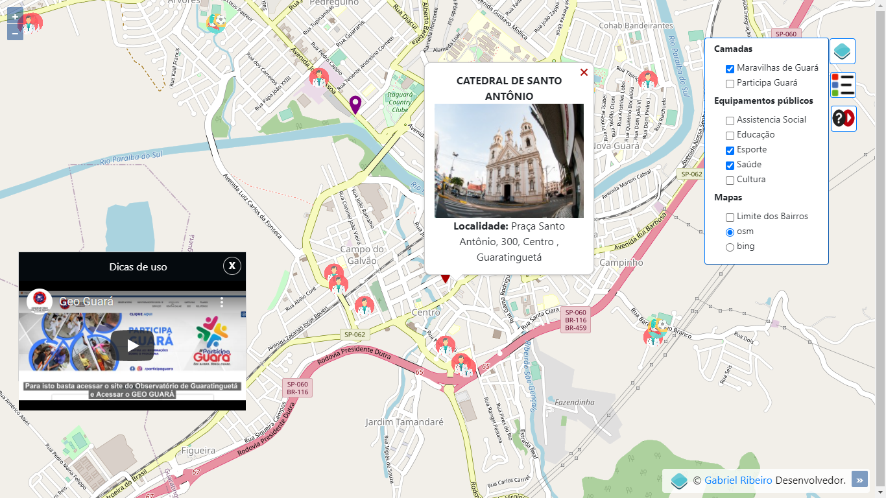
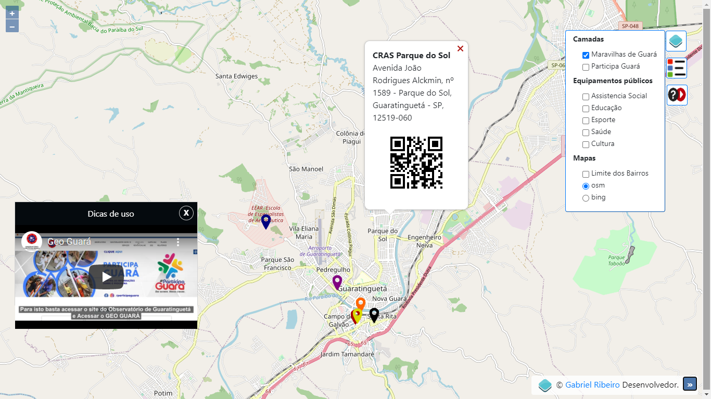

# GEOGUARA
Mapa interativo de Guaratinguetá.

Projeto desenvolvido para a Secretaria de Governo de Guaratinguetá como estagiário,
As layers foram criadas no QGIS e upados no PostgreSQL, 
Outros recursos utilizados: OPENLAYERS,GEOSERVER,HTML,CSS,JS e JQUERY.

desenvolvedor: Gabriel Ribeiro
gabrielribeirofatec@gmail.com
http://geoguara.epizy.com/

 
